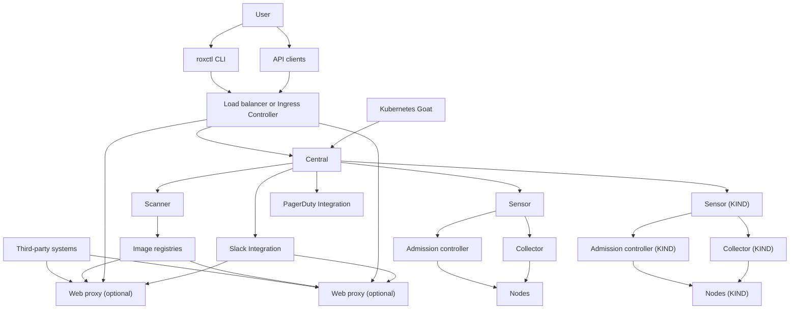

# rhacs-goat 
  
### Lcoal Setup 
A development setup for RHACS operator-based deploy in a kind cluster and with a local registry.

## Prerequisites
1. Installed kind and docker binaries.
3. Clone your fork of this repository.
  ```
  $ git clone git@github.com:<user>/rhacs-kind.git
  $ cd rhacs-kind
  ```


## Architecture




> Note: No need to use a fork repo if you don't intend to contribute upstream.

## Set up the kind cluster

1. Bootstrap the cluster and base resources. When it's done, it will show a link to the k8s dashboard and a login token.
```
$ make boostrap
```

To run k8s dashboard for monitoring on a separate terminal.
```
$ make run-k8s-dashboard
```

## Deploy resources needed to create a Central instance
```
$ make up
```
> This can take a while as it will build the images of at least the scanner, central, collecttor, and push them to the local registry.

## Build and Run the stackrox operator
```
$ make build-operator run-operator
```

## Deploy an example Central instance
```
$ make deploy-example-central
```

## Deploy a Secured Cluster instance after the Central services are up without errors.
```
$ make deploy-example-secured-cluster
```

## Initialize monitoring
```
$ make init-monitoring
```

## Run the following to port-forward the prometheus console
```
$ make run-prometheus-console
```
## Initialize the monitoring metrics
```
$ make init-monitoring-metrics
```

## Launch the stackrox UI
```
$ kubectl -n stackrox port-forward deploy/central --address localhost 8000:8443

# This can take time for the UI to load and set up a reverse proxy.
$ make up-ui
```

## Notes
1. Scanner and Central pods can take a while to load due to their DBs taking time to load.
2. Image builds can take a while.


## Kubernetes Goat Setup


- Navigate to the folder for setup and installation of the Kubernetes Goat using KiND

```
cd kubernetes-goat/platforms/kind-setup
```
- Run the following command to set up the KIND cluster

```
bash setup-kind-cluster-and-goat.sh
```

# Setting up RHACS on a Openshift V.4 Cluster.

### Prerequisites 

- An AWS Account and a Redhat console.redhat.com account, the oc cli can be downloaded form the https://console.redhat.com
- [oc cli] (https://access.redhat.com/downloads/content/290/ver=4.15/rhel---9/4.15.16/x86_64/product-software)
- [ocm ci](https://github.com/openshift-online/ocm-cli) installed and account access. 
- Rox cli can be installed from the Cenrtral UI.
- Helm installed 


Based on the Red Hat workshop initial concept 

[ACS workShop](https://redhat-scholars.github.io/acs-workshop/acs-workshop/02-getting_started.html#install_acs_central_oc_client0)

## Create OSD cluster 

```

ocm create cluster --compute-nodes 6 --compute-machine-type m5.2xlarge --region us-east-1 mfreer-acs-test
```

## Central

- Set current user as admin

```shell
oc adm policy add-cluster-role-to-user cluster-admin $(oc whoami) --as cluster-admin
```

- Create the rhacs-operator namespace

```shell
oc create ns rhacs-operator
```

- Creating the OperatorGroup CR

```shell
cat <<EOF > /dev/stdout | oc apply -f -
apiVersion: operators.coreos.com/v1
kind: OperatorGroup
metadata:
  name: rhacs-operator
  namespace: rhacs-operator
EOF
```

- Creating the Subscription CR

```shell
cat <<EOF > /dev/stdout | oc apply -f -
apiVersion: operators.coreos.com/v1alpha1
kind: Subscription
metadata:
  name: rhacs-operator
  namespace: rhacs-operator
  labels:
    operators.coreos.com/rhacs-operator.rhacs-operator: ''
spec:
  channel: stable
  installPlanApproval: Automatic
  name: rhacs-operator
  source: redhat-operators
  sourceNamespace: openshift-marketplace
EOF
```

- Wait for rhacs-operator-controller-manager rollout, and verify the version

```shell
kubectl rollout status deployment rhacs-operator-controller-manager -n rhacs-operator -w

oc get clusterserviceversion -n rhacs-operator
```

- Create Central CR

```shell
cat <<EOF > /dev/stdout | oc apply -f -
apiVersion: platform.stackrox.io/v1alpha1
kind: Central
metadata:
  name: stackrox-central-services
  namespace: rhacs-operator
spec:
  monitoring:
    openshift:
      enabled: true
  central:
    notifierSecretsEncryption:
      enabled: false
    exposure:
      loadBalancer:
        enabled: false
        port: 443
      nodePort:
        enabled: false
      route:
        enabled: true
    telemetry:
      enabled: true
    db:
      isEnabled: Default
      persistence:
        persistentVolumeClaim:
          claimName: central-db
    persistence:
      persistentVolumeClaim:
        claimName: stackrox-db
  egress:
    connectivityPolicy: Online
  scanner:
    analyzer:
      scaling:
        autoScaling: Enabled
        maxReplicas: 5
        minReplicas: 2
        replicas: 3
EOF
```

- Wait for central and scanner deployments to rollout

```shell
kubectl rollout status deployment central central-db -n rhacs-operator -w
kubectl rollout status deployment scanner scanner-db -n rhacs-operator -w
```

- Verify central endpoint (set to public via rosa edit ingress -c $CLUSTER_ID --private=false apps)

```shell
CENTRAL_URL=https://$(oc get route -n rhacs-operator central -o json | jq -r .spec.host):443
curl -k -iL $CENTRAL_URL
```

- Create operator init bundle

```shell
BUNDLE_NAME=operator
kubectl exec -n rhacs-operator deployment/central -- roxctl central --insecure-skip-tls-verify init-bundles generate $BUNDLE_NAME -p $(oc get secret central-htpasswd -n rhacs-operator -o json | jq -r .data.password | base64 --decode) --output-secrets - > scratch/$BUNDLE_NAME-init-bundle.yaml
```

- Create helm init bundle

```shell
BUNDLE_NAME=helm
  ADMIN_PW=$(oc get secret central-htpasswd -n rhacs-operator -o json | jq -r .data.password | base64 --decode)
kubectl exec -n rhacs-operator deployment/central -- roxctl central --insecure-skip-tls-verify init-bundles generate $BUNDLE_NAME -p $ADMIN_PW --output - > scratch/$BUNDLE_NAME-init-bundle.yaml
```

## Secured Clusters

- Create SecuredCluster CRs

```shell
SECURED_CLUSTER_NAME=mfreer-secure1
CENTRAL_URL= # from verify central endpoint step

cat << EOF > acs-bundles/$SECURED_CLUSTER_NAME-secure.yaml
apiVersion: platform.stackrox.io/v1alpha1
kind: SecuredCluster
metadata:
  name: stackrox-secured-cluster-services
  namespace: rhacs-operator
spec:
  clusterName: $SECURED_CLUSTER_NAME
  centralEndpoint: $CENTRAL_URL
EOF

oc apply -f acs-bundles/$SECURED_CLUSTER_NAME-secure.yaml
```

```shell
SECURED_CLUSTER_NAME=mfreer-secure2
CENTRAL_URL= # from verify central endpoint step

cat << EOF > acs-bundles/$SECURED_CLUSTER_NAME-secure.yaml
apiVersion: platform.stackrox.io/v1alpha1
kind: SecuredCluster
metadata:
  name: stackrox-secured-cluster-services
  namespace: rhacs-operator
spec:
  clusterName: $SECURED_CLUSTER_NAME
  centralEndpoint: $CENTRAL_URL
EOF

oc apply -f acs-bundles/$SECURED_CLUSTER_NAME-secure.yaml
```


### Helm

- Login to cluster via OC and init via helm

```shell

oc adm policy add-cluster-role-to-user cluster-admin $(oc whoami) --as backplane-cluster-admin

CLUSTER_NAME=mfreer-secure2
BUNDLE_PATH=

helm repo add rhacs https://mirror.openshift.com/pub/rhacs/charts/

helm install -n stackrox --create-namespace stackrox-secured-cluster-services rhacs/secured-cluster-services \
-f /root/scratch/helm-init-bundle.yaml \
--set clusterName=$CLUSTER_NAME \
--set centralEndpoint=$(yq -r '.spec.centralEndpoint' acs-bundles/secure.yaml)

kubectl rollout status deployment admission-control sensor -n stackrox -w
